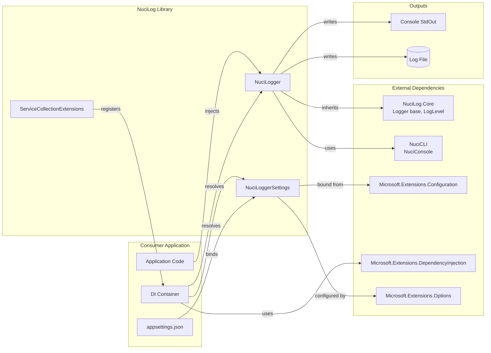
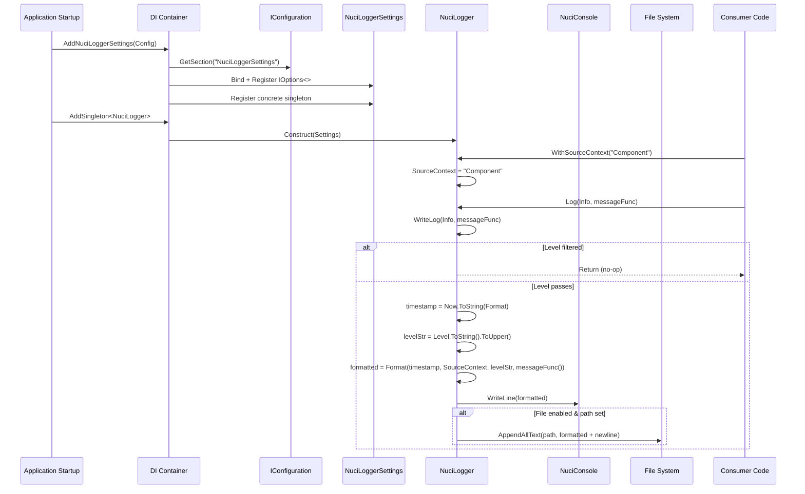
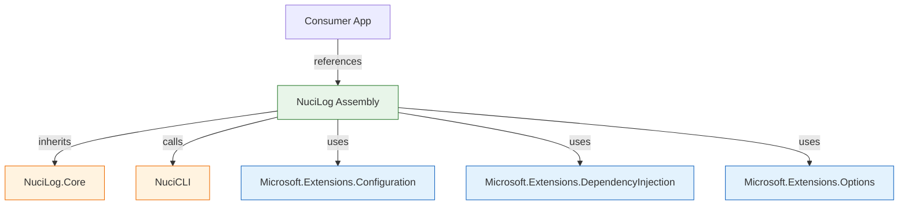

# NuciLog Architecture

This document describes the current architecture of NuciLog, a lightweight structured logging library for .NET applications. It covers the system boundary, components, runtime flows, dependencies, and operational characteristics as implemented in the repository.

## 📑 Table of Contents

- [Purpose](#-purpose)
- [System Context](#-system-context)
- [Architectural Style](#️-architectural-style)
- [Runtime Flow](#-runtime-flow)
- [Components](#-components)
- [Architectural Areas](#-architectural-areas)
- [Data Architecture](#-data-architecture)
- [Interfaces and Integrations](#-interfaces-and-integrations)
- [Dependency Direction and Rules](#-dependency-direction-and-rules)
- [External Dependencies](#-external-dependencies)
- [Deployment and Operations](#-deployment-and-operations)
- [Compatibility Contracts](#️-compatibility-contracts)
- [Testing and Verification](#-testing-and-verification)
- [Design Constraints](#️-design-constraints)
- [Extension Points](#-extension-points)
- [Source Map](#-source-map)
- [Related Documentation](#-related-documentation)

## 🎯 Purpose

NuciLog is a **library/SDK** providing structured logging capabilities for .NET applications. Its principal responsibilities are:

- Format log entries with configurable timestamp, source context, level, and message
- Write logs to console (always) and optionally to a file
- Filter log entries by minimum severity level
- Integrate with ASP.NET Core / Generic Host dependency injection
- Bind configuration from `appsettings.json` via the Options pattern

**Intended audience**: Library consumers integrating logging into .NET applications, maintainers extending the library.

**Scope**: This document covers the NuciLog project (`NuciLog/NuciLog.csproj`) only. The external packages `NuciLog.Core` and `NuciCLI` are treated as external dependencies.

## 🌐 System Context



**Principal external boundaries**:

- **Consumer Application**: Initiates logging via DI-injected `NuciLogger`; owns the DI container and configuration sources
- **NuciLog.Core (package)**: Provides abstract `Logger` base class and `LogLevel` enum; NuciLog inherits and overrides `WriteLog`
- **NuciCLI (package)**: Provides `NuciConsole.WriteLine` for colored console output; called synchronously per log entry
- **Microsoft.Extensions.Configuration**: Supplies `IConfiguration` for binding `NuciLoggerSettings` from `appsettings.json`
- **Microsoft.Extensions.DependencyInjection**: Provides `IServiceCollection` for DI registration via `ServiceCollectionExtensions`
- **Microsoft.Extensions.Options**: Implements Options pattern (`IOptions<>`, `Configure<>`) for settings binding and injection
- **Console StdOut**: Primary output sink; always written, unbuffered
- **Log File**: Secondary output sink; conditional, appended synchronously per entry

## 🏗️ Architectural Style

**Style**: **Library with single concrete implementation** — NuciLog exposes one public logger type (`NuciLogger`) that inherits from an external abstract base (`NuciLog.Core.Logger`). Configuration is a plain POCO (`NuciLoggerSettings`) bound via the Options pattern. DI registration is a single extension method.

**Consequences**:
- No internal abstraction layers — consumers depend directly on `NuciLogger` concrete type
- Configuration is immutable after startup (singleton `NuciLoggerSettings`)
- Single logger instance by default (singleton registration) — shared `SourceContext` state
- No plugin/extension model — custom sinks require inheritance or forking

```mermaid
flowchart TB
    subgraph NuciLog [NuciLog Assembly]
        Logger[NuciLogger\n(sealed)]
        Settings[NuciLoggerSettings\n(sealed)]
        Ext[ServiceCollectionExtensions\n(static)]
    end

    Core[NuciLog.Core.Logger\n(abstract, external)]
    CLI[NuciCLI.NuciConsole\n(external)]

    Logger -->|inherits| Core
    Logger -->|consumes| Settings
    Logger -->|calls| CLI
    Ext -->|registers| Settings
    Ext -->|registers| Logger
```

**Principal architecture boundaries**:

- **NuciLog Assembly**: Owns `NuciLogger`, `NuciLoggerSettings`, `ServiceCollectionExtensions`; no internal dependencies
- **NuciLog.Core Boundary**: External base class — NuciLog implements `WriteLog` override only
- **NuciCLI Boundary**: External console writer — called directly, no abstraction
- **Microsoft.Extensions Boundary**: Configuration, DI, Options — consumed via standard interfaces

## 🔄 Runtime Flow



**Principal runtime sequence**:

1. **Startup**: DI container registers `NuciLoggerSettings` (bound from configuration) and `NuciLogger` as singletons
2. **Injection**: Consumers receive `NuciLogger` via constructor injection
3. **Context Setting**: Consumer calls `WithSourceContext("ComponentName")` — sets mutable `SourceContext` on logger instance
4. **Log Call**: Consumer calls `logger.Log(LogLevel.Info, () => "Message")`
5. **Level Filter**: Base `Logger.Log` calls overridden `WriteLog`; `NuciLogger.WriteLog` checks `level > MinimumLevel` — returns early if filtered
6. **Formatting**: Timestamp generated, level string uppercased, message func invoked, `string.Format` with 4 placeholders
7. **Console Output**: `NuciConsole.WriteLine(formatted)` — always executed
8. **File Output**: If `IsFileOutputEnabled` and `LogFilePath` non-empty — `File.AppendAllText` with newline

## 🧩 Components

| Component | Responsibility | Principal Dependencies | Lifetime or Ownership |
|-----------|----------------|------------------------|-----------------------|
| `NuciLogger` | Core logging implementation; formats and writes log entries to console and file | `NuciLoggerSettings` (config), `NuciLog.Core.Logger` (base), `NuciCLI.NuciConsole` (console), `System.IO.File` (file) | Singleton (registered via DI); constructed once per container |
| `NuciLoggerSettings` | Configuration model; holds formatting, output, and filtering options | `NuciLog.Core.LogLevel` (enum) | Singleton (bound from `IOptions<>`, registered concretely) |
| `ServiceCollectionExtensions` | DI registration helpers; binds settings and registers logger | `Microsoft.Extensions.Configuration`, `Microsoft.Extensions.DependencyInjection`, `Microsoft.Extensions.Options` | Static class; no lifetime |

## 🗂️ Architectural Areas

### NuciLog Project

**Paths**:
- `NuciLog/NuciLogger.cs`
- `NuciLog/ServiceCollectionExtensions.cs`
- `NuciLog/Configuration/NuciLoggerSettings.cs`
- `NuciLog/NuciLog.csproj`

**Responsibilities**:
- Concrete logger implementation (`NuciLogger`)
- Configuration model (`NuciLoggerSettings`)
- DI registration (`ServiceCollectionExtensions`)

**Boundary rules**:
- No internal dependencies between components (all reference external packages only)
- `NuciLogger` depends on `NuciLoggerSettings` via constructor injection
- `ServiceCollectionExtensions` registers both `NuciLoggerSettings` and `NuciLogger`
- All components are `sealed`/`static` — no internal inheritance or mocking points

## 💾 Data Architecture

```mermaid
flowchart LR
    Config[appsettings.json\nnuciLoggerSettings] -->|bind| Settings[NuciLoggerSettings\n(POCO)]
    Settings -->|constructor injection| Logger[NuciLogger]
    Logger -->|reads| Settings
    Logger -->|formats| Output[Log Entry\nstring]
    Output -->|writes| Console[Console]
    Output -->|appends| File[(Log File)]
```

| Data or Store | Owner | Representation and Storage | Lifecycle or Consistency |
|---------------|-------|----------------------------|--------------------------|
| `NuciLoggerSettings` | `ServiceCollectionExtensions` (registration) | POCO with 5 properties (string, string, string, LogLevel, bool); bound from JSON | Created once at startup; immutable thereafter (singleton) |
| `SourceContext` | `NuciLog.Core.Logger` (base class) | `string` property on logger instance | Mutable; set via `WithSourceContext()`; shared across all callers (singleton logger) |
| Log Entry (formatted string) | `NuciLogger.WriteLog` | Transient `string` per log call; format: `{timestamp}｜{source}｜{level}｜{message}` | Created per call; written to console and file; not retained |
| Log File | `NuciLogger` (writes) | UTF-8 text file; one line per entry; `Environment.NewLine` separator | Append-only; no rotation, size limit, or retention policy |

## 🔌 Interfaces and Integrations

| Interface or Integration | Direction | Contract | Owner | Failure Semantics |
|--------------------------|-----------|----------|-------|-------------------|
| `NuciLogger` (concrete type) | Inbound (consumer calls) | `WithSourceContext(string)`, `Log(LogLevel, Func<string>)` | `NuciLog` | Exceptions propagate: `FormatException`, `IOException`, `UnauthorizedAccessException`, user delegate exceptions |
| `NuciLoggerSettings` (POCO) | Inbound (DI injects) | 5 public properties with defaults | `NuciLog` | Invalid values (bad format strings, enum) cause runtime exceptions in `WriteLog` |
| `IConfiguration` | Inbound (startup) | Section `NuciLoggerSettings` with 5 keys | Consumer app | Missing section → defaults; invalid enum → bind exception |
| `IServiceCollection` | Inbound (startup) | `AddNuciLoggerSettings`, `AddSingleton<NuciLogger>` | Consumer app | Null args → `ArgumentNullException` |
| `NuciConsole.WriteLine` | Outbound | `void WriteLine(string)` | `NuciCLI` package | Exception propagates (console unavailable) |
| `File.AppendAllText` | Outbound | `void AppendAllText(path, content)` | `System.IO` | `DirectoryNotFoundException`, `UnauthorizedAccessException`, `IOException` propagate |

## 🧭 Dependency Direction and Rules



**Principal dependency rules**:

- **NuciLog → External packages only** — No internal project references; all dependencies are NuGet packages
- **NuciLog → NuciLog.Core** — Inheritance dependency; `NuciLogger` overrides `WriteLog` only
- **NuciLog → NuciCLI** — Direct call to `NuciConsole.WriteLine`; no abstraction
- **NuciLog → Microsoft.Extensions.*** — Standard interfaces (`IConfiguration`, `IServiceCollection`, `IOptions<>`); no implementation coupling
- **Consumer → NuciLog** — References concrete `NuciLogger` and `NuciLoggerSettings` types directly
- **Prohibited**: Consumer depending on `NuciLog.Core` or `NuciCLI` directly for logging (though possible)
- **Prohibited**: Circular dependencies — none exist

## 📦 External Dependencies

| Dependency | Responsibility | Integration Boundary | Architectural Consequence |
|------------|----------------|----------------------|---------------------------|
| `NuciLog.Core` (3.0.0) | Abstract `Logger` base class, `LogLevel` enum | `NuciLogger` inherits `Logger`; overrides `WriteLog` | Base class controls `SourceContext`, `Log` method, `WithSourceContext`; NuciLog only implements output |
| `NuciCLI` (3.0.1) | `NuciConsole.WriteLine` for colored console output | Direct static call in `NuciLogger.WriteLog` | Console output format/coloring controlled externally; no abstraction for testing |
| `Microsoft.Extensions.Configuration.Abstractions` (10.0.9) | `IConfiguration`, `GetSection` | `ServiceCollectionExtensions` binds settings | Standard abstraction; any configuration provider works |
| `Microsoft.Extensions.DependencyInjection.Abstractions` (10.0.9) | `IServiceCollection`, DI interfaces | `ServiceCollectionExtensions` registers services | Standard DI abstraction; works with any compatible container |
| `Microsoft.Extensions.Options.ConfigurationExtensions` (10.0.9) | `services.Configure<>`, `IOptions<>` | Binds and registers `NuciLoggerSettings` | Options pattern enables validation, monitoring, snapshots |
| `Microsoft.SourceLink.GitHub` (10.0.300) | SourceLink for NuGet debugging | Build-time only (`PrivateAssets=all`) | No runtime dependency; enables source debugging for consumers |

## 🚀 Deployment and Operations

| Concern | Current Design | Architectural Consequence |
|---------|----------------|---------------------------|
| **Process topology** | Library (DLL) loaded into consumer process | No separate process; shares consumer's AppDomain/process |
| **Deployment unit** | NuGet package (`NuciLog.1.2.1.nupkg`) | Single assembly + dependencies; `IncludeSymbols=true` for debugging |
| **Persistent state** | Log file (optional) | File grows indefinitely; no rotation; consumer responsible for log management |
| **Filesystem requirements** | Write access to `LogFilePath` directory | `DirectoryNotFoundException` if directory missing; `UnauthorizedAccessException` if no write permission |
| **Network requirements** | None | Fully offline-capable |
| **Scaling assumptions** | Single logger instance (singleton) per DI container | Shared `SourceContext` under concurrency; file I/O serializes per call |
| **Startup** | DI registration + configuration binding | Synchronous; fails fast on invalid configuration |
| **Shutdown** | No explicit shutdown | File handles closed per `AppendAllText` call; no flush needed |
| **Operator-visible outputs** | Console (always), log file (conditional) | No health checks, metrics, or structured telemetry |

## 🛡️ Compatibility Contracts

| Contract | Owner | Invariant | Verification | Change Policy |
|----------|-------|-----------|--------------|---------------|
| `NuciLogger` public API | `NuciLog` | `WithSourceContext`, `Log(LogLevel, Func<string>)` signatures stable | Consumer compilation | Semantic versioning; breaking changes require major version |
| `NuciLoggerSettings` properties | `NuciLog` | 5 properties, types, defaults unchanged | Consumer binding, serialization | Additive only; no removal or type change |
| `LogLineFormat` placeholders | `NuciLog` | `{0}=timestamp`, `{1}=source`, `{2}=level`, `{3}=message` | Consumer format strings | Stable; new placeholders would be additive |
| `LogLevel` enum values | `NuciLog.Core` | Trace=0, Debug=1, Info=2, Warning=3, Error=4, Critical=5, None=6 | Level filtering logic | External package; NuciLog follows upstream |
| `appsettings.json` section name | `NuciLog` | `nuciLoggerSettings` (case-insensitive) | Configuration binding | Stable; change would break existing configs |
| NuGet package ID | `NuciLog` | `NuciLog` on nuget.org | Consumer `PackageReference` | Immutable |

## ✅ Testing and Verification

**Current state**: No test project exists in the solution. `dotnet test` passes with zero tests.

**Architecture boundaries needing verification**:

| Boundary | Current Coverage | Gap |
|----------|------------------|-----|
| `NuciLoggerSettings` defaults & binding | None | Unit tests for constructor defaults, configuration binding, enum parsing |
| `NuciLogger.WriteLog` level filtering | None | Level filter logic (>, not >=), lazy message evaluation |
| `NuciLogger.WriteLog` formatting | None | Placeholder substitution, custom formats, timestamp formats |
| `NuciLogger.WriteLog` console output | None | `NuciConsole.WriteLine` invocation |
| `NuciLogger.WriteLog` file output | None | Conditional write, append behavior, path validation |
| `ServiceCollectionExtensions` registration | None | `IOptions<>`, concrete singleton, configuration binding |
| Error paths | None | `FormatException`, `IOException`, `UnauthorizedAccessException` propagation |
| Concurrency | None | `SourceContext` bleeding, file interleaving |

**Execute principal automated verification**:

```bash
# Build
dotnet build -c Release

# Pack (verifies package metadata)
dotnet pack -c Release -o ./nupkg

# Test (currently no tests)
dotnet test --verbosity normal
```

## ⚠️ Design Constraints

- **Single logger instance**: `NuciLogger` registered as singleton → shared `SourceContext` across threads; context bleeding under concurrency
- **Synchronous file I/O**: `File.AppendAllText` opens/writes/closes per log call; blocks calling thread; no buffering or batching
- **No log rotation**: File grows unbounded; consumer must implement external rotation (logrotate, etc.)
- **Local time only**: `DateTime.Now` used for timestamps; no UTC option; timezone offset included via `K` format specifier
- **No structured logging**: Output is formatted string; no JSON, no property bags, no structured sinks
- **No `ILogger` abstraction**: Uses custom `NuciLog.Core.Logger` base; not compatible with `Microsoft.Extensions.Logging.ILogger`
- **No test coverage**: Regression risk for all behaviors; no CI validation of logic
- **Format string validation at runtime**: Invalid `LogLineFormat` or `TimestampFormat` throw `FormatException` during logging, not at startup
- **GPL-3.0-or-later license**: Copyleft; consumers must comply with GPL terms

## 🔧 Extension Points

### 1. Custom Logger via Inheritance

1. **Implement**: Create `sealed class CustomLogger(NuciLoggerSettings settings) : NuciLogger(settings)`
2. **Override**: `protected override void WriteLog(LogLevel level, Func<string> logMessage)`
3. **Register**: `services.AddSingleton<NuciLogger, CustomLogger>()` (replaces default)
4. **Preserve**: Call `base.WriteLog` for default console/file behavior, or replace entirely

**Conventions**: Must accept `NuciLoggerSettings` in constructor; should respect `MinimumLevel`, `IsFileOutputEnabled`, `LogFilePath`

### 2. Custom Console Output

1. **Fork or wrap** `NuciCLI.NuciConsole`
2. **Override** `WriteLog` to use custom writer
3. **Register** custom logger as above

### 3. Custom File Writer

1. **Override** `WriteLog` to use `StreamWriter`, `FileStream`, or async I/O
2. **Add** buffering, rotation, compression as needed
3. **Preserve** level filter and formatting logic (or replace)

### 4. Extended Configuration

1. **Add properties** to `NuciLoggerSettings` (e.g., `MaxFileSize`, `RetainDays`, `UseUtcTimestamp`)
2. **Handle** new properties in `NuciLogger.WriteLog`
3. **Update** `appsettings.json` schema documentation

## 🗺️ Source Map

| Area | Path |
|------|------|
| Core logger implementation | `NuciLog/NuciLogger.cs` |
| DI registration | `NuciLog/ServiceCollectionExtensions.cs` |
| Configuration model | `NuciLog/Configuration/NuciLoggerSettings.cs` |
| Project configuration | `NuciLog/NuciLog.csproj` |
| CI/CD pipeline | `.github/workflows/dotnet.yml` |
| User documentation | `README.md` |
| License | `LICENSE` |
| Detailed architecture | `docs/architecture.md` |
| Implementation reference | `docs/implementation.md` |
| Capabilities reference | `docs/capabilities.md` |
| Execution flows | `docs/execution-flows.md` |
| Dependencies | `docs/dependencies.md` |
| Testing specifications | `docs/testing.md` |

## 📚 Related Documentation

- [README.md](README.md) — User guide, quick start, configuration reference
- [docs/architecture.md](docs/architecture.md) — Detailed architecture (this document's source)
- [docs/implementation.md](docs/implementation.md) — Line-by-line source analysis, call graphs, thread safety
- [docs/capabilities.md](docs/capabilities.md) — Feature matrix, configuration reference, integration scenarios
- [docs/execution-flows.md](docs/execution-flows.md) — End-to-end traces, sequence diagrams, error flows
- [docs/dependencies.md](docs/dependencies.md) — Complete dependency tree, licenses, versions
- [docs/testing.md](docs/testing.md) — Test specifications, coverage targets, test utilities