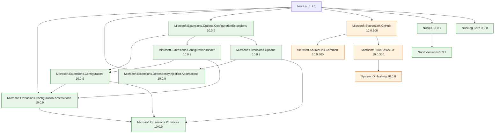

# NuciLog Dependencies Reference

## Direct Dependencies (NuciLog.csproj)

| Package | Version | Purpose | License |
|---------|---------|---------|---------|
| Microsoft.Extensions.Configuration.Abstractions | 10.0.9 | `IConfiguration`, `GetSection` | MIT |
| Microsoft.Extensions.DependencyInjection.Abstractions | 10.0.9 | `IServiceCollection`, DI interfaces | MIT |
| Microsoft.Extensions.Options.ConfigurationExtensions | 10.0.9 | `services.Configure<>`, `IOptions<>` | MIT |
| Microsoft.SourceLink.GitHub | 10.0.300 | SourceLink for NuGet debugging | MIT |
| NuciCLI | 3.0.1 | `NuciConsole.WriteLine` (colored console) | GPL-3.0-or-later |
| NuciLog.Core | 3.0.0 | `Logger` base class, `LogLevel` enum | GPL-3.0-or-later |

## Transitive Dependencies

### From Microsoft.Extensions.Configuration.Abstractions (10.0.9)
| Package | Version | Purpose |
|---------|---------|---------|
| Microsoft.Extensions.Primitives | 10.0.9 | `StringValues`, `StringSegment` |

### From Microsoft.Extensions.Configuration (10.0.9) - via Binder
| Package | Version | Purpose |
|---------|---------|---------|
| Microsoft.Extensions.Configuration.Abstractions | 10.0.9 | (already listed) |
| Microsoft.Extensions.Primitives | 10.0.9 | (already listed) |

### From Microsoft.Extensions.Configuration.Binder (10.0.9) - via Options.ConfigurationExtensions
| Package | Version | Purpose |
|---------|---------|---------|
| Microsoft.Extensions.Configuration | 10.0.9 | Configuration root |
| Microsoft.Extensions.Configuration.Abstractions | 10.0.9 | (already listed) |

### From Microsoft.Extensions.Options (10.0.9) - via Options.ConfigurationExtensions
| Package | Version | Purpose |
|---------|---------|---------|
| Microsoft.Extensions.DependencyInjection.Abstractions | 10.0.9 | (already listed) |
| Microsoft.Extensions.Primitives | 10.0.9 | (already listed) |

### From Microsoft.SourceLink.GitHub (10.0.300)
| Package | Version | Purpose |
|---------|---------|---------|
| Microsoft.SourceLink.Common | 10.0.300 | Common SourceLink infrastructure |
| Microsoft.Build.Tasks.Git | 10.0.300 | Git tasks for SourceLink |

### From Microsoft.Build.Tasks.Git (10.0.300)
| Package | Version | Purpose |
|---------|---------|---------|
| System.IO.Hashing | 10.0.8 | Hashing algorithms (xxHash, etc.) |

### From NuciCLI (3.0.1)
| Package | Version | Purpose |
|---------|---------|---------|
| NuciExtensions | 5.3.1 | Extension methods for NuciCLI |

## Dependency Graph

```
NuciLog (1.2.1, net10.0)
├── Microsoft.Extensions.Configuration.Abstractions (10.0.9)
│   └── Microsoft.Extensions.Primitives (10.0.9)
├── Microsoft.Extensions.DependencyInjection.Abstractions (10.0.9)
├── Microsoft.Extensions.Options.ConfigurationExtensions (10.0.9)
│   ├── Microsoft.Extensions.Configuration (10.0.9)
│   │   ├── Microsoft.Extensions.Configuration.Abstractions (10.0.9)
│   │   └── Microsoft.Extensions.Primitives (10.0.9)
│   ├── Microsoft.Extensions.Configuration.Binder (10.0.9)
│   │   ├── Microsoft.Extensions.Configuration (10.0.9)
│   │   └── Microsoft.Extensions.Configuration.Abstractions (10.0.9)
│   └── Microsoft.Extensions.Options (10.0.9)
│       ├── Microsoft.Extensions.DependencyInjection.Abstractions (10.0.9)
│       └── Microsoft.Extensions.Primitives (10.0.9)
├── Microsoft.SourceLink.GitHub (10.0.300) [PrivateAssets=all]
│   ├── Microsoft.SourceLink.Common (10.0.300)
│   └── Microsoft.Build.Tasks.Git (10.0.300)
│       └── System.IO.Hashing (10.0.8)
├── NuciCLI (3.0.1)
│   └── NuciExtensions (5.3.1)
└── NuciLog.Core (3.0.0)
```

## Dependency Analysis

### Runtime Dependencies (Required for Execution)
| Package | Reason |
|---------|--------|
| Microsoft.Extensions.Configuration.Abstractions | `IConfiguration.GetSection` |
| Microsoft.Extensions.DependencyInjection.Abstractions | `IServiceCollection` extensions |
| Microsoft.Extensions.Options.ConfigurationExtensions | `services.Configure<>`, `IOptions<>` |
| NuciCLI | `NuciConsole.WriteLine` |
| NuciLog.Core | `Logger` base class, `LogLevel` enum |

### Build-Only Dependencies (Not in Runtime)
| Package | Reason |
|---------|--------|
| Microsoft.SourceLink.GitHub | SourceLink metadata generation |
| Microsoft.SourceLink.Common | SourceLink infrastructure |
| Microsoft.Build.Tasks.Git | Git commit info for SourceLink |
| System.IO.Hashing | Used by Git tasks |

### Transitive Runtime Dependencies
| Package | Brought By | Used By NuciLog? |
|---------|------------|------------------|
| Microsoft.Extensions.Primitives | Configuration.Abstractions, Options | Indirectly (StringValues) |
| Microsoft.Extensions.Configuration | Options.ConfigurationExtensions | Indirectly (binding) |
| Microsoft.Extensions.Configuration.Binder | Options.ConfigurationExtensions | Indirectly (binding) |
| Microsoft.Extensions.Options | Options.ConfigurationExtensions | Indirectly (IOptions) |
| NuciExtensions | NuciCLI | No (NuciCLI internal) |

## Version Compatibility Matrix

| NuciLog | .NET | Config.Abstractions | DI.Abstractions | Options.ConfigExt | NuciCLI | NuciLog.Core |
|---------|------|---------------------|-----------------|-------------------|---------|--------------|
| 1.2.1 | 10.0 | 10.0.9 | 10.0.9 | 10.0.9 | 3.0.1 | 3.0.0 |

**Policy**: All Microsoft.Extensions packages aligned to same version (10.0.9)

## License Compatibility

| Package | License | Compatible with GPL-3.0? |
|---------|---------|--------------------------|
| Microsoft.Extensions.* | MIT | ✅ Yes |
| Microsoft.SourceLink.* | MIT | ✅ Yes |
| System.IO.Hashing | MIT | ✅ Yes |
| NuciCLI | GPL-3.0-or-later | ✅ Same license |
| NuciLog.Core | GPL-3.0-or-later | ✅ Same license |
| NuciExtensions | (Unknown, via NuciCLI) | Via NuciCLI |

**Overall**: NuciLog is GPL-3.0-or-later, all dependencies compatible.

## Vulnerability Status

**Known Issue**: `Microsoft.Build.Tasks.Git 10.0.300` - Moderate severity (GHSA-23fw-v26w-5fgq)

**Impact**: Build-time only (PrivateAssets=all), not in runtime output

**Mitigation**:
- Update when fixed version available
- Or pin to older version without vulnerability
- Does not affect NuciLog.dll consumers

## Package Size Analysis

| Component | Size | Notes |
|-----------|------|-------|
| NuciLog.dll | ~8.7 KB | Main assembly |
| NuciLog.pdb | ~15 KB | Symbols (in symbols package) |
| Dependencies | ~500 KB | Total transitive runtime |
| NuGet package | ~11.5 KB | Compressed |

## Dependency Update Strategy

### Microsoft.Extensions Packages
- Update together to maintain version alignment
- Follow .NET release cycle (10.0.x → 11.0.x)
- Test configuration binding after updates

### NuciCLI & NuciLog.Core
- Same author (hmlendea), likely updated together
- Check for breaking changes in Logger base class
- NuciCLI console output changes may affect formatting

### SourceLink Packages
- Update with .NET SDK updates
- Build-time only, low risk

## Excluded from Package (PrivateAssets=all)

| Package | Reason |
|---------|--------|
| Microsoft.SourceLink.GitHub | Build-time only |
| Microsoft.SourceLink.Common | Build-time only |
| Microsoft.Build.Tasks.Git | Build-time only |
| System.IO.Hashing | Build-time only (via Git tasks) |

These do not appear in NuGet dependency graph for consumers.

## Framework Compatibility

**Target**: net10.0 (.NET 10)

**Supported Runtimes**:
- .NET 10.0+
- Not compatible with .NET Framework, .NET Core 3.1, .NET 5-9 (without retargeting)

**To Support Older Frameworks**:
```xml
<TargetFrameworks>net8.0;net9.0;net10.0</TargetFrameworks>
```

Would require:
- Conditional compilation for API differences
- Testing on each framework
- Separate NuGet package versions or multi-target package

## Consumer Dependency Impact

When a project references NuciLog 1.2.1, it gets:

**Direct Dependencies Added**:
- Microsoft.Extensions.Configuration.Abstractions ≥ 10.0.9
- Microsoft.Extensions.DependencyInjection.Abstractions ≥ 10.0.9
- Microsoft.Extensions.Options.ConfigurationExtensions ≥ 10.0.9
- NuciCLI ≥ 3.0.1
- NuciLog.Core ≥ 3.0.0

**Transitive Dependencies Added**:
- Microsoft.Extensions.Primitives ≥ 10.0.9
- Microsoft.Extensions.Configuration ≥ 10.0.9
- Microsoft.Extensions.Configuration.Binder ≥ 10.0.9
- Microsoft.Extensions.Options ≥ 10.0.9
- NuciExtensions ≥ 5.3.1

**Version Conflicts Possible If**:
- Consumer uses different Microsoft.Extensions versions
- Consumer uses different NuciCLI/NuciLog.Core versions
- Resolution: NuGet uses nearest-wins, may need explicit version in consumer

## Build & Pack Dependencies

### Build (dotnet build)
- .NET SDK 10.0.x
- NuGet package restore
- Roslyn compiler
- MSBuild

### Pack (dotnet pack)
- All build dependencies
- NuGet.Build.Tasks.Pack
- SourceLink tasks (Git, Common, GitHub)

### Test (dotnet test)
- No test project exists
- Would need: xUnit/MSTest/NUnit, test runner, coverlet

## Dependency Visualization (Mermaid)

